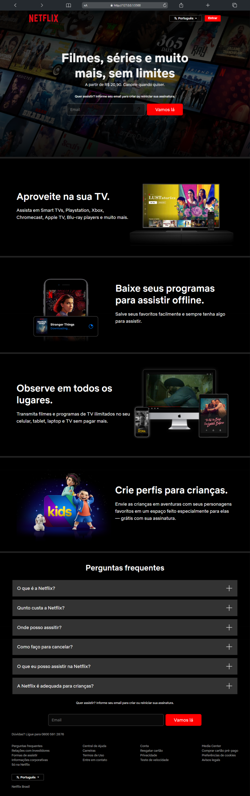

<h1 align="center" style="font-weight: bold;">Projeto Netflix 💻</h1>

<p align="center">
 <a href="#tech">Technologias</a> • 
 <a href="#clone">Clone</a>
</p>

<p align="center">
    <b>Clone da landing page da Netflix, recriado com [HTML, CSS]. Foco em design responsivo e experiência do usuário similar ao original. </b>
</p>

<p align="center">
     <a href="https://netflixclone-eduu.vercel.app/">📱 Visite este projeto</a>
</p>

<h2 id="layout">🎨 Layout</h2>

<p align="center">
    
</p>

<h2 id="tech">💻 Technologias</h2>

- HTML e CSS
- CSS Flexbox
- Responsive Layout

<h3 id="clone">Clonagem</h3>

Como clonar meu projeto

```bash
git clone https://github.com/eduardomendes117/project-netflix-clone
```
